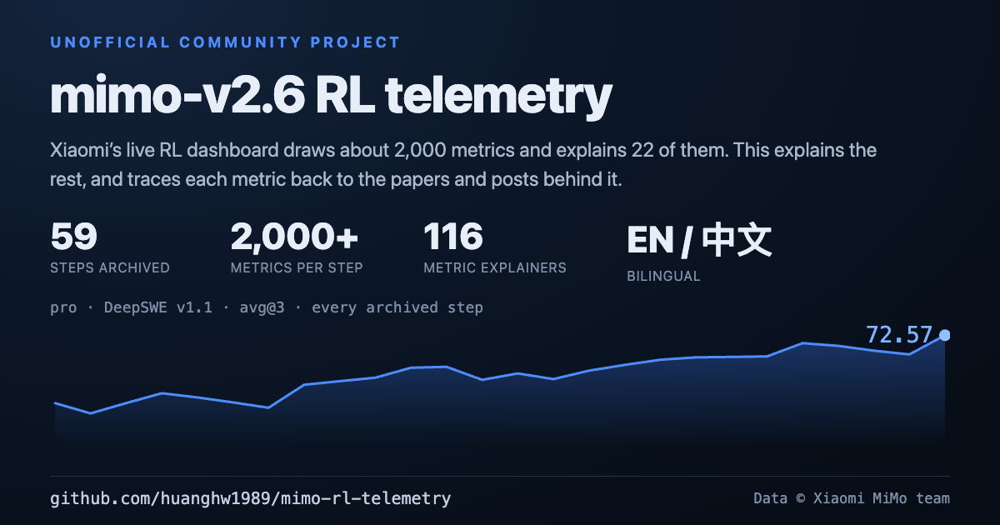

# mimo-rl-telemetry

[English](README.md) | **简体中文**

[](LICENSE)


**▶ [打开在线演示](https://huanghw1989.github.io/mimo-rl-telemetry/)** —— 任意一步回放，
不用安装、不用注册。

[](https://huanghw1989.github.io/mimo-rl-telemetry/)

给小米 MiMo 这场 300 万美元以上的公开强化学习训练做的增强遥测层：可交互的指标解读、
跨曲线相关性分析，以及按训练步回放历史。

**这是什么。** 小米 MiMo 团队在 <https://mimo.xiaomi.com/rl/> 公开了 `mimo-v2.6-pro` 和
`mimo-v2.6-flash` 两次强化学习训练的实时看板。它暴露约 2000 条指标序列，其中只有 **22 个**
带官方的一行英文说明。本项目把剩下的讲清楚：在原始页面上加一层带指标解读、数据洞察、
溯源与跨图分析的遥测层，并配上一套中英双语的成篇分析。同时把公开 JSON 接口增量同步到本地仓库，
**让这些解读能跨整轮训练核对，而不是只看某一瞬间**。

> **非官方社区项目。** 本项目与小米及 MiMo 团队无关，也未获其背书或维护，只读取公开的看板接口。
> 上游看板以及复制到 `site/`、`data/upstream/` 下的未修改资源，版权仍归小米 MiMo 所有，
> 具体文件清单见 [NOTICE.md](NOTICE.md)，详见[致谢](#致谢)。

## 为什么要做这个

上游看板画了很多，讲得很少。页面上大约有 2000 条指标序列，只有 22 个 tag 配了官方的一句说明，
而且看板不对其中任何一条给出结论。

- **一个指标到底在量什么** —— 除了那 22 句官方说明，剩下的只有一个名字和一条曲线。
  这里给的是：量什么、怎么算、为什么盯它、容易读错的地方。
- **这些数字加起来说明什么** —— 这里的每条结论都写清关键数字和复算方式，
  而不是丢给读者自己去盯着曲线看。
- **早些时候是什么样** —— 页面永远只显示最新一步，训练跑到第三天，
  前期的曲线、公告和单步耗时都已经看不到了。

所以本项目给每条指标、每条结论配上一篇解读、一条来源，或者一条能自己复算的脚本。
把站点发布过的每个数值存进一份权威的本地仓库，是为了让这些解读**能跨整轮训练核对**——
**归档是底座，不是目的。**

## 比官方看板多出来的东西

| 能力 | 官方看板 | 本项目 |
| --- | --- | --- |
| 指标解读 | 22 个指标各一句英文说明 | **116 条解读**，分 9 组：量什么、怎么算、为什么盯它、这一轮实测、容易读错的地方 |
| 数据洞察 | 无 | **34 条**从数据里挖出来的结论，每条带关键数字与复核路径 |
| 溯源 | 无 | **149 条引文条目**（去重后 109 份材料），逐字原文；另有 **32 条检索空白**，明说没有公开材料支持这条读法 |
| 跨图读数 | 每张图各管各的 | 图表联动：在任意一张图上点某一步，所有图一起跳过去 |
| "这一步为什么跳" | 无 | **分析这一步**：全指标异常度、与锚点曲线的秩相关与去趋势相关，以及这一步时段内的重启 / 版本切换 / 公告 |
| 公告 | 只增不减的英文清单 | 中文译文、每条标出 `pro@s17` / `flash@s24` 训练步、按步定位 |
| 历史 | 只有当前状态 | 任意一个同步点都能回放；`?asof=<epoch>` 深链直达 |
| 图表组合 | 首页固定那批 | 自定义看板：把自己选的图表存成 Tab |
| 离线 | 必须在线 | `bun run export` 产出自包含的 `site/offline.html` |
| 界面语言 | 英文 | 默认英文，一键切中文 |

完整功能页见 [`site/features.html`](site/features.html)。

## 快速开始

前置条件：[Bun](https://bun.sh) **>= 1.1**。只有同步上游、核验引文和翻译时才需要联网。

```bash
git clone https://github.com/huanghw1989/mimo-rl-telemetry.git
cd mimo-rl-telemetry

bun install          # 没有运行时依赖
bun run server       # → http://127.0.0.1:8787/（首次启动会自动建 SQLite 索引）
```

`bun run server` 直接服务本地仓库，页面就是一份存档：页头时钟和总成本停在最后一次同步的
时刻，不跟着本机时钟走，鼠标移到时钟上能看到数据采集自什么时间。要让数据往前走就
`bun run sync`；想同时镜像上游那几个实时小接口，用 `bun run server --live`。

仓库自带一份完整数据快照（`data/store/`，pro 到第 29 步、flash 到第 30 步），
所以看板开箱就能渲染，分析脚本也不用联网就能跑。`data/telemetry.sqlite` 是由快照派生的索引，
不入版本管理；服务端首次启动会从 `data/store/` 把它建出来，`bun run reindex` 是同一件事的显式入口，两者都不碰网络。

**看板本身不需要任何模型或 API key。** 只有想用翻译功能时才需要复制环境模板：

```bash
cp .env.example .env    # 只在需要翻译（公告 / 内容 / 文档）时复制
```

`.env.example` 里是 `OPENAI_API_KEY`、`OPENAI_BASE_URL` 和 `TEXT_MODEL`，默认模型
`gpt-5.6-luna`。看板的任何功能都不会调用模型。

其他入口：

```bash
bun run sync         # 从上游接口增量抓一次，随后更新索引
bun run bootstrap    # 从 data/seed/ 下的原始快照重建仓库（可选，仓库不附带 seed）
bun run export       # 导出单文件离线副本：site/offline.html
```

## 功能导览

### 历史回放
原站没有历史。遥测层加了一个回放开关：选任意一个采集到的同步点，整个看板就渲染那一刻——
两个 run 的状态卡、那时已完成的每一步、那时已发布的公告，以及当时的动态采样器表。
回放时钟是冻结的，滑杆在同步点之间切换，`?asof=<epoch>` 可以直接深链进某个切面。离线也能回放。

### 指标解读
116 条解读覆盖首页固定的 18 张图、各指标族（`actor`、`critic`、`penalty`、`partial`、
`dynsam`、`ctx`、`env`、`timing`）、判分组统计、评测榜，以及**动态采样器表格的 7 条逐列解读**。
每条回答四件事：这个数量的是什么、怎么算出来的、训练时为什么盯它、这一轮实测是什么样，
最后附一段"容易读错的地方"。点任意一张图，就地显示这个指标的解读。

### 数据洞察
34 条从数据里真正挖出来的结论，每条都带关键数字和复核方法。条目按类型分组（结构性事实、
反直觉、方法、数值），每条都挂一条溯源条目，写明复算口径和对应脚本。

### 溯源与检索空白
把来源反过来读：149 条引文条目（论文、技术报告、博客、官方文档，以及记录我们自己核算的
`self` 条目）各自给出题目、作者、年份、链接和**逐字原文引用**，并标注它是支持、限定还是仅提供背景。
凡是文献里找不到对应物的读法，就单列为**检索空白**（32 条），而不是假装它有文献背书。
引文可用 `bun run verify-sources` 重新核验。

### 图表联动
打开"联动"，在任意一张图上点某一步，页面上所有图都会标出这一步：竖线、取值点、读数框，
以及每张卡片右上角的数值列都从"最新值"切换成"那一步的值"。某个 run 还没走到这一步时，
数值列退到它最近的一步并标出实际步号（`@s19`），而不是画一个对不上的标记。

### 公告
公告带中文译文、`pro@s17` / `flash@s24` 训练步角标、对照原文开关，以及按步定位的滑杆。
译文放在 `content/notices.zh.json`；`bun run sync` 会自动翻译新公告，人工改过的译文不会被覆盖，
除非英文原文变了。

### 自定义看板
首页那批图是上游写死的。这里可以把自己的图表组合存成 Tab：从 metrics 页或编辑弹窗批量勾选、
切换 Tab、保留多套看板。看板存在 `localStorage` 里，跟着这台机器走，离线副本一样能用。

### 相关性分析：分析这一步
先用图表联动锁住某一步，再点**分析这一步**。面板给三块东西：全站约 2000 个指标里这一步异常度最大的
那批（取 z 与 MAD 两个尺度里较小的那个，按指标族折叠）；与锚点同涨同跌的是谁（秩相关，外加去趋势的
一阶差分秩相关）；以及这一步时段内发生了什么（重启、版本切换、公告、抬头指标与 token 量）。
相关性只负责指路，时段内的事件才是原因候选。算法内核 `site/js/correlate.js` 在线与离线共用一份，
两边数字完全一致。

### 离线导出
`bun run export` 写出 `site/data/bundle.js` 和单文件 `site/offline.html`。直接双击打开即可：
回放、解读、洞察、自定义看板、图表联动、相关性分析都能用，不需要服务端、不联网。
离线副本是导出那一刻的快照，页面也照实说：页头的城市时钟和总成本都停在数据采集时刻，
不跟着本机时钟往前走；鼠标移到时钟上能看到数据采集自什么时间（UTC 和北京时间）。

### 双语界面
站点默认英文，可一键切中文。解读、洞察、溯源三份内容的英文版由中文原文生成，
见[双语内容](#双语内容)。

## 架构

```
上游接口  ──►  src/sync.ts  ──►  data/store/            （权威 JSON 仓库）
                                     │
                                     ├──►  data/telemetry.sqlite   （派生索引，随时可重建）
                                     │
                   src/server.ts  ◄──┴──►  site/          （在线看板）
                   src/export.ts  ──────►  site/offline.html + site/data/bundle.js
```

`src/sync.ts` 是 `data/store/` 唯一的写入方。JSON 仓库是权威副本，`data/telemetry.sqlite`
是由它派生的索引，删掉随时能用 `bun run reindex` 重建。`src/server.ts` 默认直接服务这份仓库：
所有接口都在本地重建，页面因此始终是一份存档（时钟和成本停在最后一次同步时刻），要更新就再同步
一次；加 `--live` 才会额外转发上游那五个实时小接口，大的序列接口始终走本地仓库。回放模式下所有
数据都从仓库重建。`src/export.ts` 读同一份仓库，产出离线包。

**上游资源是复制的，不是分叉的。** `data/upstream/` 保存一份原站静态文件的原始副本，
`site/` 是工作副本。遥测层由**新增文件**实现——`site/js/telemetry.js`、`site/js/correlate.js`、
`site/telemetry.css`——它们包裹原站的图表构造函数、拦截 `api/*` 请求，复用原站的渲染逻辑而不是重写。
`site/js/app.js` 与 `site/index.html` 上只有少量原地修改，每一处都用 `[telemetry]` 注释标出来，
所以与原站的差异始终可审计。原站改前端时，`bun run sync` 的资源哈希比对会提示，
届时人工重新打补丁，而不是让一份分叉悄悄烂掉；见 [CONTRIBUTING.md](CONTRIBUTING.md)。

## 仓库地图

| 路径 | 内容 |
| --- | --- |
| `src/` | 管线：`sync.ts`（抓取与合并）、`store.ts` / `db.ts`（仓库与索引）、`server.ts`、`export.ts`、各 `*_report.ts` 复算脚本，以及 i18n 工具 |
| `site/` | 看板：原站资源原始副本 + 遥测层（`js/telemetry.js`、`js/correlate.js`、`telemetry.css`） |
| `content/` | 人写的指标解读、数据洞察、溯源登记表、公告译文；中文是原文，旁边是生成的 `*.en.json` |
| `data/` | 数据仓库：`store/`（随仓库发布）、`upstream/`（原站资源原始副本）、`telemetry.sqlite`（派生）、`seed/`（可选原始快照，供 `bun run bootstrap`）、`logs/` |
| `docs/` | 数据文档与工程文档，`en` 与 `zh-CN` 成对 |
| `analysis/` | 成篇分析报告、逐指标分析笔记、脚本产出的数字转储，`en` 与 `zh-CN` 成对 |

## 双语内容

站点默认英文，可切中文。**中文文件是原文**，英文文件是生成的，不要手改：

| 中文原文 | 生成的英文 | 生成命令 |
| --- | --- | --- |
| `content/metrics.json` | `content/metrics.en.json` | `bun run translate:content` |
| `content/insights.json` | `content/insights.en.json` | `bun run translate:content` |
| `content/sources.json` | `content/sources.en.json` | `bun run translate:content` |
| `docs/zh-CN/*.md` | `docs/en/*.md` | `bun run translate:docs` |
| `analysis/zh-CN/**/*.md` | `analysis/en/**/*.md` | `bun run translate:docs` |

公告译文是个例外：`content/notices.zh.json` 存的是英文公告的中文翻译，按公告 id 索引，直接维护
（新公告在同步时自动翻译）。术语由 `src/i18n_core.ts` 里的词表钉死，保证同一句中文每次译法一致。

## 每个数字都能复算

分析脚本里没有硬编码任何结论数字，全部从 `data/store/` 现算。都在项目根目录执行：

| 命令 | 产出 |
| --- | --- |
| `bun run report:length` | 生成长度的形状、乘法分解、上限、相关性（notes/08） |
| `bun run report:correlate` | 全指标 × 长度的相关性，含差分与事件剔除的稳健性检验（notes/09） |
| `bun run report:factor` | 有效自由度、主成分、冗余结构、变点（notes/10） |
| `bun run report:dataset` | 逐数据集强弱、构成效应、长度—成绩弹性（notes/11） |
| `bun run report:reward` | 奖励分布、可训练池收缩、判分漏斗与档位分（notes/12） |
| `bun run report:pipeline` | 墙钟分解、重启缺口、排队与背压（notes/13） |
| `bun run report:bench` | 最小可检测变化、自相关、滞后结构、饱和外推（notes/14） |
| `bun run report:audit` | 全指标可信度审计（notes/15） |
| `bun run report:sampler` | 动态采样器表格的逐列核验（docs/03） |
| `bun run analyze` | 一份综合的数据仓库体检报告 |
| `bun run check` | 恒等关系自检（全部通过时退出码为 0） |

## 分析索引

成篇分析在 `analysis/zh-CN/` 下（中文原文），英文版由 `bun run translate:docs` 生成到
`analysis/en/`。各篇一句话结论：

| 文档 | 一句话结论 |
| --- | --- |
| [`notes/01-站点地图与数据来源.md`](analysis/zh-CN/notes/01-站点地图与数据来源.md) | 看板上有什么、数据从哪些接口来、多久更新一次。 |
| [`notes/02-指标清单.md`](analysis/zh-CN/notes/02-指标清单.md) | 站点暴露的全部指标名，按命名空间归类，外加 22 条官方说明。 |
| [`notes/03-指标时间线.md`](analysis/zh-CN/notes/03-指标时间线.md) | 逐步数值表、首末对比、评测成绩与公告。 |
| [`notes/04-观测记录.md`](analysis/zh-CN/notes/04-观测记录.md) | 采集轮次的精简时间线。 |
| [`notes/05-数值核查与派生量.md`](analysis/zh-CN/notes/05-数值核查与派生量.md) | 已核验的恒等关系，以及成本与吞吐的派生量。 |
| [`notes/06-读看板容易踩的坑.md`](analysis/zh-CN/notes/06-读看板容易踩的坑.md) | 看板上没有提示、却会让判断出错的结构性陷阱，每条附验证方法。 |
| [`notes/07-flash停止与资源配比解读.md`](analysis/zh-CN/notes/07-flash停止与资源配比解读.md) | 一次有序停止怎么读：三种停止形态、成本速率当机器数读、"数据点采完"的三个信号。 |
| [`notes/08-生成长度突增解读.md`](analysis/zh-CN/notes/08-生成长度突增解读.md) | 生成长度那条线的完整解读：十条判断规则 + 术语速查。 |
| [`notes/09-生成长度相关性分析.md`](analysis/zh-CN/notes/09-生成长度相关性分析.md) | 1944 / 1974 个指标对长度的全量相关性，含差分与事件剔除的稳健性检验。 |
| [`notes/10-指标空间与潜在因子.md`](analysis/zh-CN/notes/10-指标空间与潜在因子.md) | 约 2000 个指标的有效自由度只有 11~13；前两个主成分两条 run 能对上，第三个开始就是各自的运维细节。参与率 11.21（pro）/ 12.99（flash）；15 个指标复现 83.5% 方差；跨 run 逐指标轨迹相关中位仅 0.156。 |
| [`notes/11-逐数据集异质性.md`](analysis/zh-CN/notes/11-逐数据集异质性.md) | 成绩提升**不是**靠把权重挪到简单题上（配比项 −0.27pp / +0.84pp）；但"总生成长度"这个总量有 8%~23% 是配比效应。25 个数据集跨 run 涨幅秩相关 ρ = 0.582（p = 0.0023）。 |
| [`notes/12-奖励与判分结构.md`](analysis/zh-CN/notes/12-奖励与判分结构.md) | 判分没有变松，反而在收紧；可训练池收缩抵消了 58% 的全对率收益。五维档位分 4.4051 → 4.2902（p = 2.5e-8）；池占比 0.7188 → 0.5528（flash）。 |
| [`notes/13-异步管线与机时账.md`](analysis/zh-CN/notes/13-异步管线与机时账.md) | 缺口能精确复现，但**不等于停机**：其中一部分是跑完又被 `redo` 作废的白烧。缺口 pro 26.15h ≈ \$537k（账单的 27.7%）；flash 14.15h ≈ \$145k（17.0%）。 |
| [`notes/14-评测可信度与饱和预测.md`](analysis/zh-CN/notes/14-评测可信度与饱和预测.md) | 最近几次评测在统计上已经看不出进步：6 条序列的最后 5 点斜率全部包含 0；115 个单步变化经多重比较校正后只剩 1 个显著。DeepSWE 的最小可检测变化 4.56（pro）/ 6.43（flash）。 |
| [`notes/15-指标可信度审计.md`](analysis/zh-CN/notes/15-指标可信度审计.md) | 16.0%（pro）/ 14.7%（flash）的指标可以直接丢掉；恒 0/恒 1/常数 311 个，"报 0" 259 个；断点能被外部事件解释的只有 43.0% / 44.4%。 |
| [`reports/A1-看板数据解读.md`](analysis/zh-CN/reports/A1-看板数据解读.md) | 逐栏目的解读：先讲大白话，再讲专业含义。 |
| [`reports/A2-训练洞察-第1期.md`](analysis/zh-CN/reports/A2-训练洞察-第1期.md) – [第3期](analysis/zh-CN/reports/A2-训练洞察-第3期.md) | 前 25 步的三期跟进分析；第 3 期记录了哪些判断被证实、哪些被推翻。 |
| [`reports/A3-bench-judgement-table.md`](analysis/zh-CN/reports/A3-bench-judgement-table.md) 与 `analysis/zh-CN/numbers/` | 脚本产出的数字转储（`A3-*-numbers.json`）、已合并进看板的候选洞察，以及 115 行评测单步变化判定表。 |

## 关键结论

下面这些数字都取自分析窗口（pro 第 24 步 / flash 第 30 步），且每条都由
[「每个数字都能复算」](#每个数字都能复算)里的脚本从 `data/store/` 现算。

1. **首页那条"训练器与推理引擎分歧"的曲线涨了三倍，但它是加权平均的假象。**
   全局 KL 从 0.00219 涨到 0.00769，可最新鲜的数据桶只从 0.00219 动到 0.00264（涨两成）；
   全局值的上涨主要来自陈旧数据在 batch 里占了更大比重。flash 第 25 步给了第二个更干净的证据：
   重启后数据全新，平均过期程度从 2.18 掉到 0.32，全局 KL 从 0.0101 掉到 0.0060，
   而桶 0 的 KL 只从 0.0034 到 0.0035。全局 KL 和过期程度相关 +0.93，桶 0 只有 −0.19 / +0.20。
2. **`timing_s/step` 和运行卡片上的"本步已用时"都不含重启等待时间。** pro 因此少报了
   **23.7 小时**（占真实墙钟的 33%），折合约 **48.8 万美元**；flash 少报 14.6 小时（占 22%），
   约 **15.0 万美元**。没有重启的步上报值和真实值差 10 秒以内，有重启的差几小时——
   所以这个缺口确实来自重启。
3. **两次训练的成绩提升，主要来自"把做对一半的题变成次次做对"，不是攻克不会的题。**
   pro 的 `avg@n` 涨了 **6.88 个百分点**：其中"全对率上升"贡献 +8.41、"中间池缩小"是 −4.16、
   "中间池里的题自己变好"是 +2.62。而"16 次一次都没做对"的比例只从 14.6% 降到 13.5%
   （flash 从 16.1% 降到 14.6%）。26 步下来这道墙没有松动。
4. **成本的核心差别在"同一个 token 要多少张卡"，不在"做了多少事"。** 两边单步的训练 token 量
   差不多（pro 平均 **22.2 亿**、flash **25.9 亿**），但每 **10 亿 token** 的成本 pro 是
   **3.52 万美元**、flash 是 **1.07 万美元**，差 **3.3 倍**。累计到写这份文档时：
   pro **149.1 万美元** / flash **69.7 万美元**。
5. **生成长度一路涨到 1.68 倍（pro）/ 2.13 倍（flash），但"长度换分数"这个说法站不住。**
   首页那把"生成长度"和"平均通过率"画在一起看着几乎完全同步（秩相关 +0.79 / +0.93），
   可两条线都随时间往上走。取一阶差分之后 pro 只剩 −0.06（p = 0.77）、flash 是 −0.48
   （p = 0.008）：**长度跳升的那几步，通过率倾向于不涨甚至下降。** 代价落在训练器：
   每 10 亿 token 的训练时间涨了 47%~48%。
6. **这约 2000 个指标只相当于 12 条独立曲线。** 有效自由度 11.21（pro）/ 12.99（flash）；
   15 个指标就能复现 83.5% 的方差；跨 run 逐指标轨迹相关的中位数只有 0.156。
7. **16% 的指标可以直接丢掉。** 16.0%（pro）/ 14.7%（flash）的指标可以整条丢弃，
   另有一批"看着有数、其实不能信"。

## 文档索引

| 文档 | 内容 |
| --- | --- |
| [`docs/zh-CN/01-网站数据文档.md`](docs/zh-CN/01-网站数据文档.md) | 7 个接口的字段含义、单位、指标命名规律、已验证的恒等关系，以及 9 个读数据时容易踩的坑。 |
| [`docs/zh-CN/02-本地遥测与同步机制.md`](docs/zh-CN/02-本地遥测与同步机制.md) | 目录结构、差量同步算法、存储格式选型（附实测体积）、SQLite 表结构，以及回放 / 解读 / 联动 / 公告 / 自定义看板 / 相关性分析各自怎么实现。 |
| [`docs/zh-CN/03-采样器表格字段口径考证.md`](docs/zh-CN/03-采样器表格字段口径考证.md) | 动态采样器表格每一列的口径：哪些是接口字段、哪些是页面现算的、哪些恒等式能复算、哪些说法没有公开依据。 |

`docs/zh-CN/` 是中文原文，对应的英文版由 `bun run translate:docs` 生成到 `docs/en/`
（文件名见 `src/translate_docs.ts` 里的映射）；翻译跑完之前英文目录可能还不完整。

## 参与贡献

前置条件、怎么跑自检、怎么加一条指标解读或数据洞察、溯源登记表的规则、双语的写作流程，
都写在 [CONTRIBUTING.md](CONTRIBUTING.md)。变更记录见 [CHANGELOG.md](CHANGELOG.md)。

## 许可

本项目代码与文档采用 MIT 许可，见 [LICENSE](LICENSE)。

## 致谢

- 看板、接口，以及 `site/`、`data/upstream/` 下那些未修改的静态资源，版权归
  **小米 MiMo**（<https://mimo.xiaomi.com/rl/>）所有；本项目只把它们作为本地回放与比对的
  参考副本收录，不适用本项目的 MIT 许可。
- 仓库里的全部分析内容都来自公开的看板数据和公开资料，引用逐字登记在
  `content/sources.json`。
- 使用 [Bun](https://bun.sh) 构建；本地看板用的是 Bun 自带的 SQLite 驱动，没有运行时依赖。
